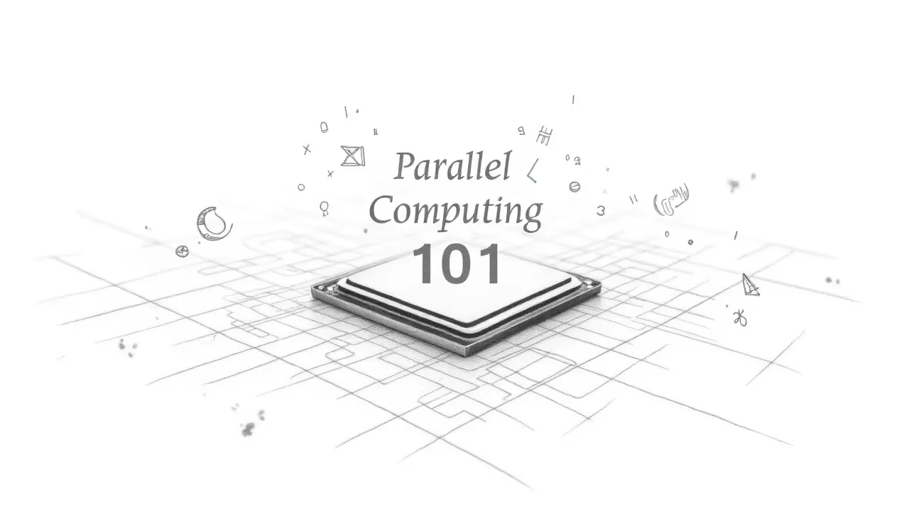

# Parallel Computing 101



## Introduction

So you know DSA and small projects you've coded, right? But have you ever wondered how many cores your calculator program or Tic-Tac-Toe AI actually uses on your 8-core CPU? Probably just one. That's because most programs run sequentially—one instruction at a time. (No wonder your "find the shortest route for the micromouse" algorithm timed out—poor thing was running on a single core, struggling through every possible path!)

Now imagine you want to simulate the weather for the next week, train a neural network, or run a massive physics simulation. Doing it on a single core would take forever. That's where **parallel computing** comes in: it lets you split the work across multiple cores, CPUs, GPUs, or even supercomputers, making huge computations run much faster.

**Read the full blog post**: [Parallel Computing 101: A Beginner's Guide to OpenMP, MPI, and CUDA](https://medium.com/@nayanthanethsara/parallel-computing-101-a-beginners-guide-to-openmp-mpi-and-cuda-83dc8b28dc82)

## Why Parallel Computing Matters

Sequential processing takes too long, so we use **parallel computing**, which splits programs into smaller tasks that run simultaneously across CPU cores, multiple machines, or thousands of GPU cores.

### Real-World Applications

- **Weather prediction**: Simulating temperature, wind, and rainfall at once across different regions
- **Scientific simulations**: Chemistry, physics, biology experiments with thousands of calculations happening simultaneously
- **Machine learning & AI**: Training deep learning models on GPUs can take hours instead of days
- **Gaming & Finance**: Real-time simulations, risk analysis, rendering 3D graphics—all happen in parallel
- **Supercomputing tasks**: Climate models, physics simulations, genome sequencing

> _"A NASA computer model simulates the astonishing track and forceful winds of Hurricane Sandy."_ - [NASA Scientific Visualization Studio](https://svs.gsfc.nasa.gov/11269/)

## The Tools We'll Explore

So now that we get why parallel computing matters, let's actually look at how we can do it.

There are a few popular frameworks that make it easy to write parallel programs—and don't worry, they're not as scary as they sound.

We'll explore three of them:

### [OpenMP](OpenMP/)

Makes your CPU multi-core friendly. Just sprinkle a few directives and your loops run in parallel.

**Perfect for**: Multi-threaded applications on shared-memory systems

**Examples in this repo**:

- Hello World with OpenMP
- Parallel loops and reductions
- Matrix multiplication with threading

### [MPI (Message Passing Interface)](MPI/)

Great for distributed systems, like clusters or cloud VMs, where multiple processes communicate.

**Perfect for**: Large-scale distributed computing across multiple machines

**Examples in this repo**:

- Basic MPI communication
- Collective operations (broadcast, reduce, scatter/gather)
- Distributed matrix multiplication

### [CUDA](CUDA/)

Lets your program use thousands of GPU cores, perfect for heavy computations like matrix math or AI.

**Perfect for**: Massively parallel computations on NVIDIA GPUs

**Examples in this repo**:

- CUDA Hello World
- Tiled matrix multiplication
- GPU memory management

## A Quick Note About OOP

OOP is great for organizing and reusing code, but in parallel computing, the focus is on **speed and hardware efficiency**. So, we keep it simple and procedural—just loops and data—making it easier to split work across threads or processes.

## Project Structure

```
parallel-101/
├── OpenMP/          # OpenMP examples and tutorials
│   ├── hello/       # Basic OpenMP programs
│   ├── loop/        # Parallel loop patterns
│   └── matrix/      # Matrix multiplication
├── MPI/             # MPI examples and tutorials
│   ├── hello/       # Basic MPI programs
│   ├── comm/        # Communication patterns
│   └── matrix/      # Distributed matrix multiplication
├── CUDA/            # CUDA examples and tutorials
│   ├── hello/       # Basic CUDA programs
│   └── matrix/      # GPU matrix multiplication
└── images/          # Project images and diagrams
```

## Getting Started

### Prerequisites

Depending on which framework you want to explore, you'll need:

**For OpenMP**:

- GCC compiler with OpenMP support (usually built-in)
- `gcc` or `clang` with `-fopenmp` flag

**For MPI**:

- MPI implementation (OpenMPI or MPICH)
- Install on macOS: `brew install open-mpi`

**For CUDA**:

- NVIDIA GPU with CUDA support
- CUDA Toolkit from NVIDIA
- `nvcc` compiler

### Quick Start

1. **Clone this repository**:

   ```bash
   git clone https://github.com/NayanthaNethsara/parallel-101.git
   cd parallel-101
   ```

2. **Choose your framework** and navigate to the respective directory:

   - For OpenMP: `cd OpenMP/`
   - For MPI: `cd MPI/`
   - For CUDA: `cd CUDA/`

3. **Follow the README** in each directory for specific compilation and execution instructions.

## Learning Path

We recommend exploring the frameworks in this order:

1. **Start with OpenMP** - Easiest to set up, runs on your local machine
2. **Move to MPI** - Learn distributed computing concepts
3. **Try CUDA** - Dive into GPU programming (requires NVIDIA GPU)

Each directory contains progressive examples from "Hello World" to more complex applications like matrix multiplication.

## Performance Comparison

Throughout this repository, you'll find performance benchmarks comparing:

- Sequential vs. Parallel execution
- Different optimization techniques
- Scaling across multiple cores/processes/GPUs

Check the individual READMEs and log files in each implementation for detailed performance metrics.

## Contributing

Found a bug? Want to add more examples? Contributions are welcome! Feel free to:

- Open an issue
- Submit a pull request
- Suggest new examples or frameworks

## Resources

- [OpenMP Official Documentation](https://www.openmp.org/)
- [MPI Tutorial](https://mpitutorial.com/)
- [CUDA Programming Guide](https://docs.nvidia.com/cuda/cuda-c-programming-guide/)
- [Parallel Computing Basics](https://hpc.llnl.gov/documentation/tutorials)

## License

This project is open source and available for educational purposes.

---

**Happy Parallel Computing!**

_Remember: With great power (cores) comes great responsibility (avoiding race conditions)!_
